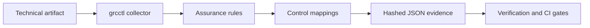

# GRC Engineering OS

[](https://github.com/kulpritsec/grc-engineering-os/actions/workflows/ci.yml)

A Debian-based GRC engineering and executable-assurance platform.

GRC Engineering OS turns governance requirements into technical assessments, control mappings, machine-readable evidence, and enforceable delivery gates.

> **Status:** Alpha. The current release is a working control-plane prototype, not yet a standalone Linux distribution or certified compliance product.

## Why This Exists

Traditional GRC platforms often document whether controls should exist. GRC Engineering OS is intended to test whether technical artifacts demonstrate those controls and preserve the resulting evidence.

The project separates three concerns:

1. **Platform:** `grcctl`, evidence models, assurance rules, mappings, and integrations.
2. **Tooling:** Terraform/OpenTofu assurance and future cloud, container, identity, and agentic-system plugins.
3. **Distribution:** A future reproducible Debian environment containing the platform and validated toolchain.

## Architecture



## Current Capabilities

| Command | Capability |
|---|---|
| `grcctl doctor` | Validates the local environment and produces baseline evidence |
| `grcctl evidence verify` | Validates supported evidence schemas and detects changes |
| `grcctl scan terraform` | Assesses Terraform/OpenTofu JSON plans |
| `--fail-on-findings` | Returns a nonzero exit code for CI enforcement |

## Requirements

- Debian GNU/Linux 13 or another supported Linux environment
- Python 3.13 or newer
- `uv`
- Git
- Rootless Podman
- OpenTofu for the Terraform demonstration

## Quick Start

```bash
git clone https://github.com/kulpritsec/grc-engineering-os.git
cd grc-engineering-os

uv sync
uv run grcctl doctor
```

Verify the generated baseline:

```bash
uv run grcctl evidence verify \
  evidence/system-baseline.json
```

## Terraform Assurance Demonstration

The repository includes an intentionally insecure AWS Terraform lab. It uses mock credentials for local plan generation and must not be applied to a cloud account.

Generate a local plan:

```bash
cd labs/terraform-aws-insecure

tofu init
tofu validate
tofu plan -out=tfplan
tofu show -json tfplan > plan.json

chmod 600 tfplan plan.json
cd ../..
```

Assess the plan:

```bash
uv run grcctl scan terraform \
  labs/terraform-aws-insecure/plan.json
```

Verify the assessment evidence:

```bash
uv run grcctl evidence verify \
  evidence/terraform-assessment.json
```

Enable CI-style enforcement:

```bash
uv run grcctl scan terraform \
  labs/terraform-aws-insecure/plan.json \
  --fail-on-findings
```

The insecure lab currently produces four findings:

- Administrative access exposed to the internet
- S3 public-access protections disabled
- Destructive S3 bucket deletion enabled
- No explicit Terraform-managed S3 encryption configuration detected

See [Terraform Assurance Rules](docs/terraform-assurance-rules.md) for rule semantics, mappings, and limitations.

## Evidence Model

Generated evidence includes:

- Schema and assessment type
- Collection timestamp
- Input artifact SHA-256
- Scanner identity and version
- Resource and finding counts
- Finding-specific observations
- Control mappings
- Remediation guidance
- Canonical evidence SHA-256

The evidence hash provides integrity and tamper detection. It does not by itself provide identity, authenticity, nonrepudiation, or trusted timestamping.

Terraform plans and generated evidence may contain sensitive information. They are excluded from Git and written locally with owner-only permissions.

## Development

Run the complete quality pipeline:

```bash
uv sync
uv run ruff format --check .
uv run ruff check .
uv run mypy src
uv run pytest \
  --cov=grcctl \
  --cov-report=term-missing \
  --cov-fail-under=70
uv build
```

All changes to `main` must use a pull request and pass the `Quality and tests` GitHub Actions check.

## Project Boundaries

GRC Engineering OS does not currently:

- Apply Terraform infrastructure
- Prove organizational compliance
- Replace professional control assessment or risk judgment
- Guarantee that the absence of a finding means a resource is secure
- Digitally sign evidence
- Operate as a production-ready Linux distribution

Findings are technical observations and candidate control mappings—not certifications or legal conclusions.

## Roadmap

1. External YAML policy packs and rule metadata
2. SARIF export and GitHub code-scanning integration
3. OSCAL-compatible evidence and assessment results
4. Additional cloud, container, identity, and CI/CD plugins
5. Signed evidence bundles and provenance attestations
6. Reproducible Debian packages and installation images

## Repository

- Source: https://github.com/kulpritsec/grc-engineering-os
- CLI package: `grcctl`
- Maintainer: Sean Atkinson / `kulpritsec`
